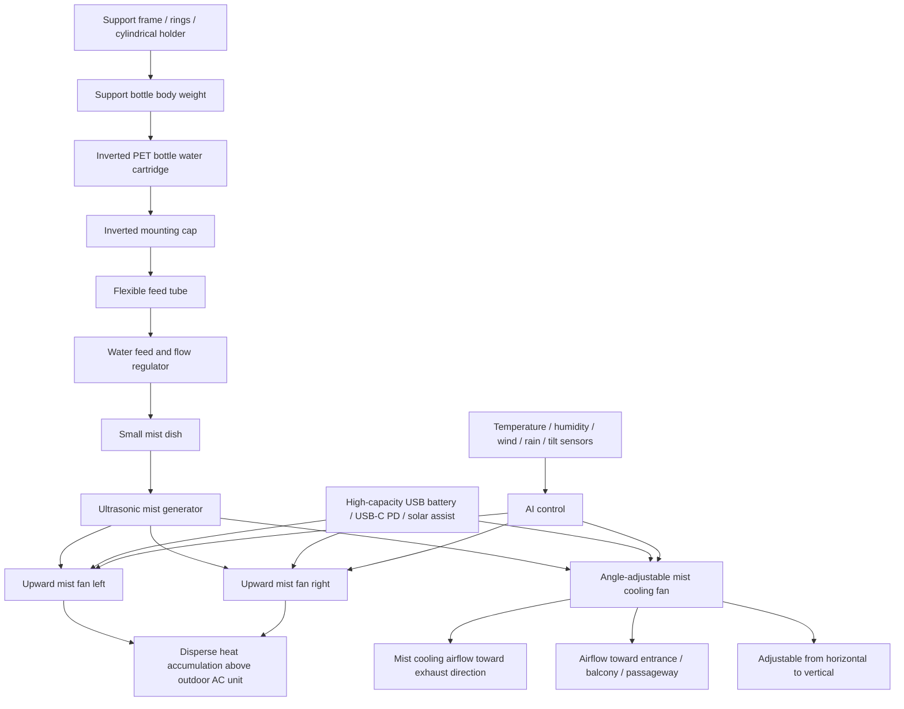

# Tri-Directional Adjustable Mist Cooling Stand and Inverted PET Bottle Water Cartridge

## Extension for Tank Hygiene, Outdoor AC Unit Surroundings, and General-Purpose Local Cooling Nodes

> 日本語: [TRI_DIRECTIONAL_MIST_COOLING_STAND_AND_BOTTLE_CARTRIDGE_ja.md](./TRI_DIRECTIONAL_MIST_COOLING_STAND_AND_BOTTLE_CARTRIDGE_ja.md)  
> العربية: [TRI_DIRECTIONAL_MIST_COOLING_STAND_AND_BOTTLE_CARTRIDGE_ar.md](./TRI_DIRECTIONAL_MIST_COOLING_STAND_AND_BOTTLE_CARTRIDGE_ar.md)

This document extends the Center-Mist Ultrasonic Cooling Fan Concept from a fixed-tank cooling device into a modular system using an inverted PET bottle water cartridge, interchangeable support frames, and a tri-directional adjustable mist cooling stand.

This is not a verified commercial product. It is a conceptual and engineering proposal. Practical implementation requires validation of water hygiene, electrical safety, overturning safety, weather resistance, wind behavior, humidity conditions, outdoor AC unit warranty implications, and maintenance procedures.

---

## 1. Problems with Conventional Tank-Type Mist Fans

Many commercial mist fans and compact mist-cooling devices use a built-in tank or a dedicated water reservoir. This structure is simple, but it tends to leave residual water after use. Slime, mold-like growth, biofilm, odor, and microbial growth may accumulate in the tank bottom, corners, water path, and around the mist-generation unit.

This issue is especially important for ultrasonic mist systems because the device converts tank water into fine droplets and releases them into the air. Using stagnant or contaminated water is therefore undesirable. Conventional tank-type systems require regular draining, cleaning, drying, disinfection, and water-quality management.

In real use, however, not every user will disassemble, scrub, rinse, and fully dry a tank after every use. A safer design should therefore reduce the cleaning burden, minimize residual water, and allow the water container itself to be replaced.

---

## 2. Inverted PET Bottle Water Cartridge

This concept treats a PET bottle not as a temporary substitute for a proprietary tank, but as a replaceable water cartridge.

A 1.5L or 2L PET bottle can be mounted upside down and used to gravity-feed water into a small mist-generation dish. As water is consumed, the bottle gradually empties. This reduces the amount of water that remains inside the main device for long periods.

The hygiene-management target is separated into two parts: the external replaceable bottle, and the small internal mist dish and water path. If the container becomes dirty, the bottle can be replaced, washed, or recycled instead of continuing to use a contaminated proprietary tank.

For cleaning, the bottle can be filled with water and a small amount of neutral detergent, shaken, thoroughly rinsed, and dried. If odor or visible contamination remains, the bottle can simply be replaced.

If detergent is used, sufficient rinsing and drying are necessary so that detergent residue is not aerosolized. When tap water is used in an ultrasonic mist system, local water quality may cause mineral deposition, white dust, or scale accumulation on the transducer. For indoor or long-duration use, filtered water, RO water, distilled water, or regular transducer cleaning may be preferable.

---

## 3. Common PET Bottle Neck Interface

In this concept, the PET bottle neck is treated as a standardized water-cartridge interface rather than just a fill opening.

Many beverage PET bottles have similar neck geometries. By modularizing the inverted mounting cap, check valve, air-inlet valve, and flow regulator, the same water and mist-generation core can be reused while the support structure is changed for different bottle sizes and operating environments.

The cooling core can therefore remain common: an inverted mounting cap, small mist dish, ultrasonic mist generator, center airflow fan, drain outlet, and cleanable water path. Only the external support frame changes by use case.

A compact tabletop model may use a 500ml to 600ml bottle with a low-center-of-gravity support base. A household or outdoor model may use a 1.5L to 2L bottle combined with a floor stand, outdoor stand, wall mount, pole mount, or anti-overturning base.

However, not every PET bottle neck is perfectly identical. Practical implementation should therefore include interchangeable adapters for different neck diameters and thread shapes. A standard adapter can be used as the baseline, while conversion rings can support regional or special bottle variations.

---

## 4. Support Frame and Flexible Feed Tube for Inverted Mounting

In the inverted PET bottle cartridge system, the bottle is first filled with water, then the dedicated cap module is tightened, and the bottle is turned upside down before being inserted into the support frame.

The key point is that the cap should not carry the full weight of a filled bottle. A 1.5L to 2L bottle contains roughly 1.5kg to 2kg of water. If this load is carried only by the cap thread, water outlet, or tube connection, it may cause leakage, breakage, loosening, overturning, or connection fatigue.

Therefore, the cap module should be treated as a water-sealing and feed-control part, while the bottle body should be supported by the external frame.

A basic mounting sequence is as follows:

1. Fill the PET bottle with water.
2. Tighten the inverted mounting cap module.
3. Turn the bottle upside down.
4. Insert the bottle body into a support frame, ring, cylindrical holder, or stand.
5. The feed tube below the cap connects to the small mist dish or flow-regulation unit.
6. Water is supplied only as needed through the check valve, air-inlet valve, and flow regulator.

The feed tube should preferably be a flexible silicone tube or an equivalent water-resistant tube, rather than rigid piping. However, the design should not rely on tube stretch itself. Instead, the tube should have enough slack to absorb small angle changes and positional tolerances during mounting.

Desirable tube requirements include:

- Resistant to twisting while the cap is tightened.
- Resistant to kinking when the bottle is inverted.
- Sufficient inner diameter for the required water feed.
- Strain relief at the tube root.
- Removable, cleanable, and replaceable.
- Does not carry the bottle weight.
- Minimizes residual stagnant water in the feed path.

The support structure should hold not only the bottle neck but also the body, shoulder, or bottom-side region using rings or a cylindrical holder. A tabletop model may use a compact low-center-of-gravity holder, while an outdoor model may combine pole mounting, wall mounting, floor base, and anti-overturning rings.

This structure allows the cap to focus on sealing and feed control, while the support frame carries the bottle weight. It reduces the risk of leakage, connection breakage, tube detachment, and overturning, making the inverted PET bottle cartridge easier to operate safely.

---

## 5. Evaporative Cooling Assistance Around Outdoor AC Units

This concept can also be placed near household or commercial outdoor air-conditioning units to reduce local heat accumulation and soften hot exhaust air.

An outdoor AC unit draws in outdoor air, exchanges heat through its condenser, and releases heat from the indoor space to the outside. If the air entering the outdoor unit is very hot, heat-exchange conditions become more difficult and compressor load may increase.

This concept does not aim to spray water directly onto the outdoor unit. Instead, it cools the air around the outdoor unit, or the air before it enters the intake side, using mist and airflow. It may also reduce hot-air accumulation around the exhaust side.

The hot exhaust air from an outdoor unit is often warmer and therefore has lower relative humidity than the surrounding air, assuming the absolute humidity is unchanged. This can leave room for evaporative cooling. Cooling the exhaust plume mainly reduces local heat stress, while improving AC efficiency would require cooling air before it enters the intake side.

Directly spraying water or mineral-rich droplets onto the heat exchanger, fan motor, circuit board, wiring, or electrical compartment should be avoided. It may cause corrosion, scale deposition, contamination, electrical risks, leakage risks, increased airflow resistance, or loss of manufacturer warranty.

Therefore, this system should be designed not as a device that wets and cools the outdoor unit itself, but as a device that evaporatively cools the surrounding air.

---

## 6. Tri-Directional Adjustable Mist Cooling Stand

The system can be extended into a tri-directional stand that combines two upward mist fans and one angle-adjustable mist cooling fan.

The two upward fans push mist and air upward. They are intended to disperse heat accumulating above the outdoor AC unit and reduce the local hot-air layer around the unit, while avoiding direct mist intake into the condenser.

The angle-adjustable fan can be pointed toward the exhaust direction, an entrance area, balcony, passageway, garden, outdoor workspace, shelter, farm, or public space. By allowing adjustment from horizontal to vertical, the device becomes a general-purpose outdoor cooling stand rather than a product limited to outdoor AC units.

The aim is not to blow mist directly into the AC intake or heat exchanger. The aim is to tune the surrounding air, upward heat plume, and exhaust direction through controlled evaporative cooling.

Power can be supplied by a removable high-capacity USB power bank, USB-C PD source, solar-charging unit, or similar low-voltage system. Outdoor use requires weather-resistant protection for the battery compartment, with safeguards against overheating, water ingress, overturning, overcharging, and overdischarging.

Outdoor stands also require anti-overturning design. A weighted base, low-center-of-gravity water base, ground pegs, wall mount, pole mount, tilt sensor, wind sensor, and automatic shutdown should be considered. When using an inverted 1.5L or 2L bottle, the center of gravity becomes higher, so the structure is better suited to floor, outdoor stand, or pole-mounted configurations than small tabletop use.

---

## 7. AI and Sensor Control

Evaporative cooling becomes less effective in high humidity. Therefore, the device should monitor outdoor temperature, relative humidity, estimated wet-bulb temperature, wind direction, wind speed, rain, outdoor AC unit operation, wetness of the surrounding surface, overturning risk, and water level.

Example operating conditions include:

- High outdoor temperature.
- Low relative humidity, or sufficient dry-bulb and wet-bulb temperature difference.
- No rain.
- Mist does not blow back into the outdoor unit interior.
- The device does not block intake or exhaust airflow.
- Water quality and water path are normal.
- Surrounding surfaces are not excessively wet.
- The stand is stable.

Example shutdown conditions include:

- High humidity and low evaporative-cooling potential.
- Rain.
- Strong wind blowing mist into the outdoor unit or electrical parts.
- Excessive wetness around the installation area.
- Tilt, overturning, or abnormal vibration.
- Low water, feed failure, or transducer abnormality.
- Outdoor AC unit is off, or cooling assistance is unnecessary.

---

## 8. Structural Image

*Figure: Tri-directional adjustable mist cooling stand with inverted PET bottle cartridge, flexible feed tube, and support frame.*

---

## 9. Positioning

This tri-directional adjustable mist cooling stand is not only for outdoor AC unit surroundings. It can also serve as a general-purpose local cooling node for entrances, balconies, gardens, outdoor workspaces, farms, shelters, and public spaces.

Where conventional tank-type products depend on a tank that must be cleaned after use, this system emphasizes replaceable water containers, reduced residual water inside the device, and support structures that can be changed without changing the core cooling mechanism.

In addition, by limiting the cap to water sealing and feed control while the support frame carries the bottle weight, the design can reduce leakage, breakage, tube detachment, and overturning risks.

It is an implementation extension of the Center-Mist Ultrasonic Cooling Fan Concept that integrates cooling performance, hygiene, maintenance, reusability, and outdoor operational safety.

---

## License

CC BY 4.0
