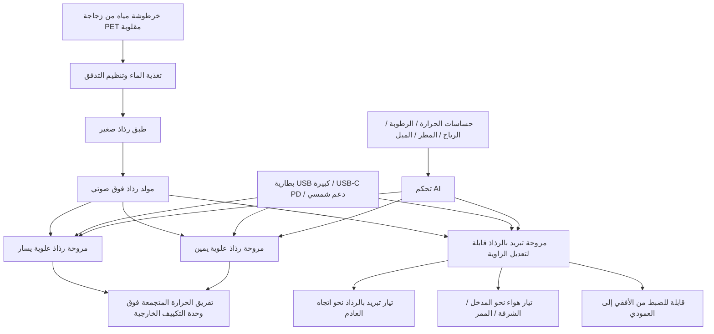

# حامل تبريد بالرذاذ قابل للتوجيه في ثلاثة اتجاهات وخرطوشة مياه من زجاجة PET مقلوبة

## امتداد لمشكلة نظافة الخزانات، وتبريد محيط وحدات التكييف الخارجية، وعقد التبريد الموضعي متعددة الاستخدام

> 日本語: [TRI_DIRECTIONAL_MIST_COOLING_STAND_AND_BOTTLE_CARTRIDGE_ja.md](./TRI_DIRECTIONAL_MIST_COOLING_STAND_AND_BOTTLE_CARTRIDGE_ja.md)  
> English: [TRI_DIRECTIONAL_MIST_COOLING_STAND_AND_BOTTLE_CARTRIDGE.md](./TRI_DIRECTIONAL_MIST_COOLING_STAND_AND_BOTTLE_CARTRIDGE.md)

تعرض هذه الصفحة امتدادًا لمفهوم مروحة التبريد بالرذاذ فوق الصوتي المركزي، بحيث لا يعتمد على خزان ثابت، بل على خرطوشة مياه من زجاجة PET مقلوبة، وهياكل دعم قابلة للاستبدال، وحامل تبريد بالرذاذ قابل للتوجيه في ثلاثة اتجاهات.

هذه ليست مواصفات منتج مثبت تجريبيًا، بل مقترح مفاهيمي وهندسي. يتطلب التنفيذ العملي التحقق من سلامة المياه، والسلامة الكهربائية، ومقاومة الانقلاب، ومقاومة الطقس، وسلوك الرياح، وظروف الرطوبة، وتأثيره المحتمل على ضمان وحدات التكييف الخارجية، وسهولة الصيانة.

---

## 1. مشكلة مراوح الرذاذ ذات الخزان التقليدي

تعتمد كثير من مراوح الرذاذ وأجهزة التبريد الصغيرة المتوفرة في السوق على خزان داخلي أو وعاء ماء مخصص. هذه البنية بسيطة، لكنها تميل إلى ترك ماء متبقٍ بعد الاستخدام. ومع مرور الوقت قد تتكون طبقات لزجة، ونمو فطري أو عفن مائي، وبيوفيلم، وروائح، ونمو ميكروبي في قاع الخزان، والزوايا، ومسارات المياه، وحول وحدة توليد الرذاذ.

تزداد أهمية هذه المشكلة في أنظمة الرذاذ فوق الصوتي، لأنها تحول ماء الخزان إلى قطرات دقيقة وتطلقها في الهواء. لذلك لا يُعد استخدام ماء راكد أو ملوث أمرًا مرغوبًا. تحتاج الأنظمة التقليدية ذات الخزان إلى تفريغ وتنظيف وتجفيف وتعقيم وإدارة جودة المياه بصورة دورية.

لكن في الاستخدام الواقعي، لا يقوم كل المستخدمين بتفكيك الخزان وفركه وشطفه وتجفيفه بالكامل بعد كل استخدام. لذلك ينبغي أن يقلل التصميم الآمن عبء التنظيف، وأن يقلل الماء المتبقي، وأن يتيح استبدال وعاء الماء نفسه.

---

## 2. خرطوشة مياه من زجاجة PET مقلوبة

يعامل هذا المفهوم زجاجة PET ليس كبديل مؤقت للخزان المخصص فقط، بل كخرطوشة مياه قابلة للاستبدال.

يمكن تركيب زجاجة PET بسعة 1.5L أو 2L مقلوبة، بحيث تغذي الماء بالجاذبية إلى طبق صغير لتوليد الرذاذ. ومع استهلاك الماء، تفرغ الزجاجة تدريجيًا. وهذا يقلل كمية الماء التي تبقى داخل الجهاز الرئيسي لفترة طويلة.

ينقسم نطاق إدارة النظافة إلى جزأين: الزجاجة الخارجية القابلة للاستبدال، والطبق الداخلي الصغير ومسار الماء. إذا اتسخ وعاء الماء، يمكن استبدال الزجاجة أو غسلها أو إعادة تدويرها، بدل الاستمرار في استخدام خزان مخصص متلوث.

للتنظيف، يمكن ملء الزجاجة بالماء وكمية صغيرة من منظف متعادل، ثم رجها، وشطفها جيدًا، وتجفيفها. وإذا بقيت رائحة أو تلوث مرئي، يمكن استبدال الزجاجة نفسها.

إذا استُخدم المنظف، يجب الشطف والتجفيف جيدًا حتى لا يتحول أي بقايا منظف إلى رذاذ. وعند استخدام ماء الصنبور في نظام رذاذ فوق صوتي، قد تسبب جودة المياه المحلية ترسب المعادن، أو الغبار الأبيض، أو تراكم القشور على المحول فوق الصوتي. لذلك قد يكون استخدام ماء مرشح أو ماء RO أو ماء مقطر أو تنظيف المحول بصورة دورية أفضل في الاستخدام الداخلي أو الطويل.

---

## 3. واجهة مشتركة لعنق زجاجة PET

في هذا المفهوم، يُعامل عنق زجاجة PET كواجهة موحدة لخرطوشة المياه، وليس كمجرد فتحة تعبئة.

تمتلك كثير من زجاجات المشروبات البلاستيكية أشكالًا متقاربة للعنق. وإذا تم تحويل غطاء التركيب المقلوب، وصمام منع الرجوع، وصمام إدخال الهواء، ومنظم التدفق إلى وحدات مشتركة، يمكن استخدام النواة نفسها لتغذية الماء وتوليد الرذاذ، مع تغيير هيكل الدعم فقط حسب حجم الزجاجة وبيئة الاستخدام.

لذلك يمكن إبقاء نواة التبريد مشتركة: غطاء تركيب مقلوب، طبق رذاذ صغير، مولد رذاذ فوق صوتي، مروحة تدفق مركزي، منفذ تصريف للماء المتبقي، ومسار ماء قابل للتنظيف. أما هيكل الدعم الخارجي فيتغير حسب الاستخدام.

في نموذج مكتبي صغير، يمكن استخدام زجاجة بسعة 500ml إلى 600ml مع قاعدة منخفضة مركز الثقل. وفي نموذج منزلي أو خارجي، يمكن استخدام زجاجة 1.5L إلى 2L مع حامل أرضي أو حامل خارجي أو تثبيت جداري أو تثبيت على عمود أو قاعدة مانعة للانقلاب.

ومع ذلك، ليست كل أعناق زجاجات PET متطابقة تمامًا. لذلك ينبغي في التنفيذ العملي توفير محولات قابلة للاستبدال لأقطار وخيوط مختلفة. ويمكن اعتماد محول قياسي كأساس، مع حلقات تحويل للتعامل مع الاختلافات الإقليمية أو الزجاجات الخاصة.

---

## 4. مساعدة التبريد التبخري حول وحدات التكييف الخارجية

يمكن وضع هذا المفهوم قرب وحدات التكييف الخارجية المنزلية أو التجارية لتخفيف تجمع الحرارة المحلي وتقليل حدة هواء العادم الساخن.

تسحب وحدة التكييف الخارجية الهواء الخارجي، وتبادل الحرارة عبر المكثف، وتطلق الحرارة المنقولة من الداخل إلى الخارج. وإذا كان الهواء الداخل إلى الوحدة الخارجية شديد السخونة، تصبح شروط التبادل الحراري أصعب وقد يزيد حمل الضاغط.

لا يهدف هذا المفهوم إلى رش الماء مباشرة على وحدة التكييف الخارجية. بل يهدف إلى تبريد الهواء حول الوحدة، أو الهواء قبل دخوله إلى جهة السحب، باستخدام الرذاذ وتدفق الهواء. كما يمكنه تخفيف تجمع الهواء الساخن في جهة العادم.

يكون هواء العادم الساخن من الوحدة الخارجية غالبًا أعلى حرارة، وبالتالي أقل رطوبة نسبية إذا بقيت الرطوبة المطلقة نفسها. وقد يترك ذلك مجالًا للتبريد التبخري. تبريد تيار العادم يخفض غالبًا الإجهاد الحراري المحلي، أما تحسين كفاءة التكييف فيتطلب تبريد الهواء قبل دخوله إلى جهة السحب.

ينبغي تجنب رش الماء أو القطرات الغنية بالمعادن مباشرة على المبادل الحراري، أو محرك المروحة، أو اللوحة الإلكترونية، أو الأسلاك، أو الأجزاء الكهربائية. فقد يسبب ذلك تآكلًا، وترسب قشور، وتلوثًا، ومخاطر كهربائية، وتسربًا، وزيادة مقاومة تدفق الهواء، أو فقدان ضمان الشركة المصنعة.

لذلك يجب تصميم هذا النظام ليس كجهاز يبلل الوحدة الخارجية لتبريدها، بل كجهاز يبرد الهواء المحيط بها تبخيريًا.

---

## 5. حامل تبريد بالرذاذ قابل للتوجيه في ثلاثة اتجاهات

يمكن توسيع النظام إلى حامل ثلاثي الاتجاهات يجمع بين مروحتين للرذاذ باتجاه علوي ومروحة تبريد بالرذاذ قابلة لتعديل الزاوية.

تدفع المروحتان العلويتان الرذاذ والهواء إلى الأعلى. والغرض منهما تفريق الحرارة المتجمعة فوق وحدة التكييف الخارجية وتقليل طبقة الهواء الساخنة المحلية حول الوحدة، مع تجنب دخول الرذاذ مباشرة إلى المكثف.

أما المروحة القابلة لتعديل الزاوية، فيمكن توجيهها نحو اتجاه العادم، أو مدخل المنزل، أو الشرفة، أو الممر، أو الحديقة، أو مكان العمل الخارجي، أو الملجأ، أو المزرعة، أو الفضاء العام. وبإتاحة الضبط من الوضع الأفقي إلى العمودي، يصبح الجهاز حامل تبريد خارجيًا عامًا، وليس منتجًا محدودًا بوحدات التكييف الخارجية فقط.

ليس الهدف هو دفع الرذاذ مباشرة إلى مدخل الهواء أو المبادل الحراري للوحدة الخارجية. بل الهدف هو ضبط الهواء المحيط، وعمود الحرارة الصاعد، واتجاه العادم من خلال تبريد تبخيري مضبوط.

يمكن تزويد الطاقة عبر بطارية USB كبيرة قابلة للإزالة، أو مصدر USB-C PD، أو وحدة شحن شمسية، أو نظام منخفض الجهد مشابه. ويتطلب الاستخدام الخارجي حماية مقاومة للرذاذ والمطر الخفيف لقسم البطارية، مع حماية من السخونة الزائدة، ودخول الماء، والانقلاب، والشحن الزائد، والتفريغ الزائد.

تحتاج الحوامل الخارجية أيضًا إلى تصميم مانع للانقلاب. ويمكن التفكير في قاعدة ثقيلة، أو قاعدة ماء منخفضة مركز الثقل، أو أوتاد أرضية، أو تثبيت جداري، أو تثبيت على عمود، أو حساس ميل، أو حساس رياح، أو إيقاف تلقائي. وعند استخدام زجاجة 1.5L أو 2L مقلوبة، يرتفع مركز الثقل، لذلك يكون الهيكل أنسب للتكوين الأرضي أو الخارجي أو المثبت على عمود من الاستخدام المكتبي الصغير.

---

## 6. التحكم بالذكاء الاصطناعي والحساسات

تصبح فعالية التبريد التبخري أضعف عند الرطوبة العالية. لذلك ينبغي أن يراقب الجهاز درجة الحرارة الخارجية، والرطوبة النسبية، ودرجة الحرارة الرطبة المقدرة، واتجاه الرياح، وسرعتها، والمطر، وحالة تشغيل وحدة التكييف الخارجية، ورطوبة السطح المحيط، وخطر الانقلاب، ومستوى الماء.

تشمل أمثلة شروط التشغيل:

- ارتفاع درجة الحرارة الخارجية.
- انخفاض الرطوبة النسبية، أو وجود فرق كافٍ بين درجة الحرارة الجافة والرطبة.
- عدم وجود مطر.
- عدم رجوع الرذاذ إلى داخل وحدة التكييف الخارجية.
- عدم إعاقة دخول الهواء أو خروجه.
- سلامة جودة الماء ومسار التغذية.
- عدم ابتلال الأسطح المحيطة بشكل مفرط.
- استقرار الحامل.

وتشمل أمثلة شروط الإيقاف:

- رطوبة عالية وفرصة تبريد تبخري منخفضة.
- وجود مطر.
- رياح قوية تدفع الرذاذ إلى داخل الوحدة الخارجية أو الأجزاء الكهربائية.
- ابتلال مفرط حول منطقة التركيب.
- ميلان أو انقلاب أو اهتزاز غير طبيعي.
- نفاد الماء أو فشل التغذية أو خلل في المحول فوق الصوتي.
- توقف وحدة التكييف الخارجية أو عدم الحاجة إلى التبريد المساعد.

---

## 7. صورة البنية

*Figure: حامل تبريد بالرذاذ ثلاثي الاتجاهات مع خرطوشة مياه من زجاجة PET مقلوبة.*

---

## 8. الموضع ضمن المنظومة

هذا الحامل القابل للتوجيه في ثلاثة اتجاهات ليس مخصصًا فقط لمحيط وحدات التكييف الخارجية. يمكن أن يعمل أيضًا كعقدة تبريد موضعية عامة للمداخل، والشرفات، والحدائق، ومناطق العمل الخارجية، والمزارع، ومراكز الإيواء، والفضاءات العامة.

بينما تعتمد المنتجات التقليدية ذات الخزان على خزان يجب تنظيفه بعد الاستخدام، يركز هذا النظام على أوعية ماء قابلة للاستبدال، وتقليل الماء المتبقي داخل الجهاز، وهياكل دعم يمكن تغييرها دون تغيير نواة التبريد.

إنه امتداد تطبيقي لمفهوم مروحة التبريد بالرذاذ فوق الصوتي المركزي، يدمج أداء التبريد، والنظافة، وسهولة الصيانة، وقابلية إعادة الاستخدام، وسلامة التشغيل الخارجي.

---

## License

CC BY 4.0
