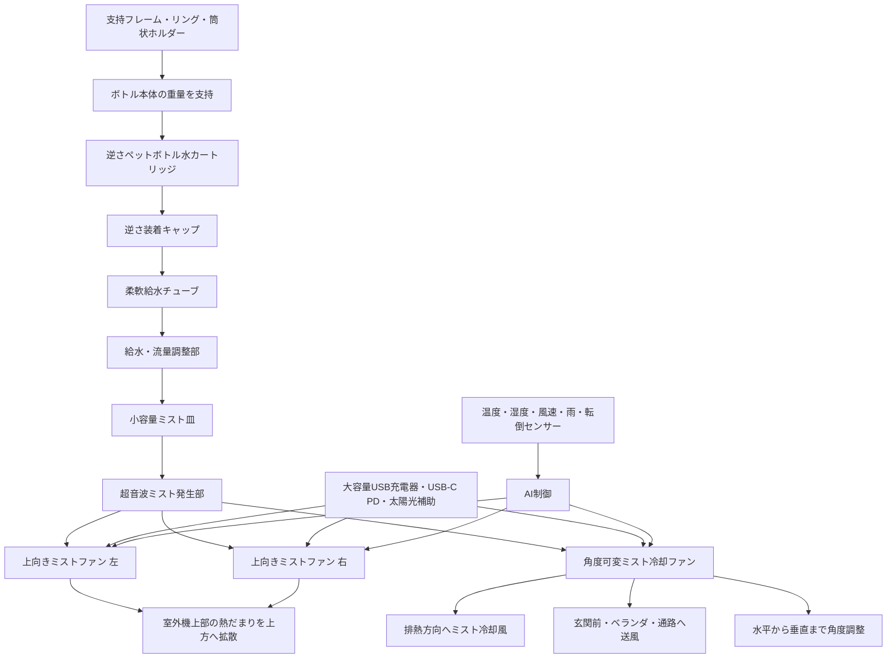

# 三方向可変ミスト冷却スタンドと逆さペットボトル水カートリッジ構造

## 市販タンク式との違い、室外機周辺冷却、汎用屋外冷却ノードへの拡張

> English: [TRI_DIRECTIONAL_MIST_COOLING_STAND_AND_BOTTLE_CARTRIDGE.md](./TRI_DIRECTIONAL_MIST_COOLING_STAND_AND_BOTTLE_CARTRIDGE_ja.md)  
> العربية: [TRI_DIRECTIONAL_MIST_COOLING_STAND_AND_BOTTLE_CARTRIDGE_ar.md](./TRI_DIRECTIONAL_MIST_COOLING_STAND_AND_BOTTLE_CARTRIDGE_ar.md)

本ページは、中央ミスト型超音波冷却ファン構想を、固定タンク式ではなく、逆さペットボトル水カートリッジ、交換式支持構造、三方向可変ミスト冷却スタンドとして拡張するための設計メモである。

ここに示す内容は実証済み製品ではなく、概念的・工学的提案である。実装には、水質安全性、電気安全性、転倒安全性、耐候性、風環境、湿度条件、室外機メーカー保証、保守性の検証が必要である。

---

## 1. 市販タンク式ミストファンの課題

市販のミストファンや小型ミスト冷却機器の多くは、本体内部または専用容器に水を貯めるタンク式である。この方式は構造が単純である一方、使用後に水が残りやすく、タンク内部、底面、角部、給水経路、ミスト発生部周辺に、ぬめり、水カビ、バイオフィルム、臭気、雑菌が発生しやすいという課題を持つ。

特に超音波ミスト方式では、タンク内の水を微細な水滴として空気中へ放出するため、滞留水や汚れた水をそのまま使用することは望ましくない。そのため、従来型タンク式では、定期的な排水、洗浄、乾燥、除菌、水質管理が必要となる。

しかし現実には、一般利用者が毎回タンクを分解して洗浄し、完全に乾燥させるとは限らない。したがって、衛生設計では「利用者がこまめに洗うこと」を前提にするだけでなく、「洗浄負担を小さくすること」「水が残りにくいこと」「汚れた容器を交換できること」が重要になる。

---

## 2. 逆さペットボトル水カートリッジ方式

本構想では、専用タンクを固定的に使い続けるのではなく、ペットボトルを交換可能な水カートリッジとして扱う。

1.5Lまたは2L級のペットボトルを上下逆に装着し、重力によって小容量のミスト発生皿へ水を供給する。水は使用に応じて消費され、最終的にボトル側は空になるため、本体内部に大量の水が長時間残りにくい。

この方式では、衛生管理の対象を「本体内蔵の大型タンク」から「交換可能な外部ボトル」と「小容量ミスト皿・給水経路」に分離できる。水を貯める容器が汚れた場合でも、容器そのものを交換、洗浄、またはリサイクルできるため、ぬめりや水カビが蓄積した専用タンクを使い続けるリスクを低減できる。

洗浄する場合も、ペットボトルに水と少量の中性洗剤を入れて振り洗いし、十分にすすいで乾燥させることで対応しやすい。汚れや臭いが取れない場合、ボトル自体を交換すればよい。

ただし、洗剤を使って洗浄した場合は、すすぎ残しがミスト化されないよう、十分なすすぎと乾燥が必要である。また、水道水を超音波ミスト化する場合は、地域の水質によってミネラル付着、白い粉、振動子のスケール蓄積が起こる可能性がある。そのため、室内利用や長時間利用では、浄水、RO水、精製水、または定期的な振動子洗浄を組み合わせることが望ましい。

---

## 3. 共通ペットボトル口部インターフェース

本構想では、ペットボトルの口部を単なる給水口ではなく、共通化された水カートリッジ・インターフェースとして扱う。

多くの飲料用ペットボトルは近い口部形状を持つため、逆さ装着キャップ、給水弁、空気導入弁、流量調整部を共通モジュール化すれば、ボトル容量や利用場所に応じて支持構造だけを変更する設計が可能となる。

この方式では、冷却コアそのものは共通化できる。すなわち、逆さ装着キャップ、小容量ミスト皿、超音波ミスト発生部、中央送風ファン、残水排出口、給水経路を一体の基本モジュールとして設計し、外側の支持構造のみを用途別に差し替える。

卓上小型モデルでは、500mlから600ml級のペットボトルを想定し、低重心の小型支持台を用いる。家庭用または屋外用モデルでは、1.5Lから2L級のペットボトルを想定し、床置き支持台、屋外スタンド、壁面固定、支柱固定、転倒防止ベースなどを組み合わせる。

ただし、すべてのペットボトル口部が完全に同一であるとは限らないため、実装時には複数口径・複数ネジ形状へ対応する交換式アダプターを用意することが望ましい。標準口径用アダプターを基本とし、特殊ボトルや地域差に対しては変換リングで対応する。

---

## 4. 逆さ装着時の支持構造と柔軟給水チューブ

逆さペットボトル水カートリッジ方式では、ペットボトルに水を入れた後、専用キャップモジュールを締め、その状態でボトルを上下逆にして支持フレームへ装着する。

このとき重要なのは、キャップ部だけで満水状態のペットボトル重量を支えないことである。1.5Lから2L級のボトルでは、水だけで約1.5kgから2kgの重量があり、これをキャップのネジ部、給水口、チューブ接続部だけで受けると、漏水、破損、緩み、転倒、接続部劣化の原因となる。

そのため、本方式では、キャップ部を「水密接続・給水制御部」として扱い、ボトル本体の重量は支持フレームで受ける構造とする。

基本的な装着手順は以下である。

1. ペットボトルに水を入れる。
2. 逆さ装着用キャップモジュールを締める。
3. ボトルを上下逆にする。
4. ボトル本体を支持フレーム、リング、筒状ホルダー、またはスタンドへ差し込む。
5. キャップ下部の給水チューブが、小容量ミスト皿または流量調整部へ接続される。
6. 逆止弁、空気導入弁、流量調整部を通じて、必要量だけがミスト発生部へ供給される。

給水チューブには、硬い固定配管ではなく、柔軟性のあるシリコンチューブまたは同等の耐水チューブを用いることが望ましい。ただし、チューブの伸縮そのものに依存するのではなく、装着時の角度変化や位置ずれを吸収できる程度の余裕長を持たせる。

チューブには以下の要件が望ましい。

- キャップ締め付け時にねじれにくいこと
- 逆さ装着時に折れ曲がりにくいこと
- 給水量を妨げない内径を持つこと
- 根元に折れ防止構造を持つこと
- 分解・洗浄・交換ができること
- ボトル重量をチューブで受けないこと
- 給水経路に残水が滞留しにくいこと

支持構造としては、ボトルの首だけでなく、胴体、肩部、底部側を保持するリングや筒状ホルダーを組み合わせることが望ましい。卓上型では低重心の小型ホルダー、屋外型では支柱固定、壁面固定、床置きベース、転倒防止リングを組み合わせる。

この構造により、キャップ部は水密接続と給水制御に集中し、ボトル重量は支持フレームで受けることができる。結果として、漏水、接続部破損、チューブ抜け、転倒リスクを抑えながら、逆さペットボトル水カートリッジ方式を安全に運用しやすくなる。

---

## 5. エアコン室外機周辺の気化冷却補助

本構想は、家庭用・業務用エアコン室外機の周辺に配置することで、室外機周辺の熱だまりや排熱空気を緩和する補助冷却装置としても応用できる。

エアコン室外機は、外気を取り込み、熱交換器を通じて室内から移動した熱を外部へ放出する。そのため、室外機に取り込まれる空気の温度が高いほど、熱交換条件は厳しくなり、コンプレッサー負荷が増える可能性がある。

本構想では、室外機そのものへ水を直接噴霧するのではなく、室外機の吸気側または周辺空気をミストと送風によって気化冷却し、熱交換器へ入る空気、または室外機周辺に滞留する排熱空気を緩和することを目的とする。

特に、室外機から排出される熱風は温度が高く、相対湿度が低下しやすいため、気化冷却によって熱風の温度を下げられる可能性がある。ただし、排熱後の空気を冷却することは主に周辺環境の熱ストレス緩和に寄与する。一方、エアコン効率の改善を狙う場合は、室外機の吸気側に入る前の空気を冷却する配置が重要となる。

ただし、室外機の熱交換器、ファンモーター、基板、配線部へ水滴やミネラル分を直接当てる設計は避けるべきである。直接噴霧は、腐食、スケール付着、汚れ、電装部リスク、漏電リスク、通風抵抗増加、保証対象外化などの問題を引き起こす可能性がある。

そのため、本方式は「室外機を濡らして冷やす装置」ではなく、「室外機の周辺空気を気化冷却する装置」として設計する必要がある。

---

## 6. 三方向可変ミスト冷却スタンド構造

本構想は、エアコン室外機周辺の熱だまりや排熱空気を緩和するため、上向きミストファンと角度可変ミスト冷却ファンを組み合わせた三方向型スタンド構造へ拡張できる。

基本構成は、上向きにミストと風を送る二つのファンと、水平方向から垂直方向まで角度調整できる一つの可変ファンである。上向きファンは、室外機上部に滞留しやすい熱気を上方へ押し上げ、周辺の熱だまりを分散させる。これにより、室外機周辺の局所的な高温環境を緩和し、吸気側へ直接ミストを吸い込ませずに、周辺空気の温度を下げることを狙う。

一方、角度可変ファンは、室外機の排熱方向、玄関前、ベランダ、通路、屋外作業場などに向けてミスト冷却風を送るために使用する。水平から垂直まで角度調整できる構造とすることで、室外機専用装置ではなく、生活空間、公共空間、農地、避難所、屋外作業環境へ応用可能な汎用ミスト冷却スタンドとなる。

この方式では、室外機の吸入口や熱交換器へミストを直接吹き込むことを目的としない。直接噴霧は、フィンの汚れ、腐食、スケール付着、電装部リスク、漏電リスク、保証対象外化などを招く可能性があるためである。本構造の目的は、室外機本体を濡らして冷やすことではなく、室外機周辺の空気、上昇する熱気、排熱風の進行方向を気化冷却によって緩和することである。

電源には、取り外し可能な大容量USB充電器、モバイルバッテリー、USB-C PD電源、太陽光充電ユニットなどを利用できる。屋外利用では、バッテリー部を防滴構造とし、過熱、浸水、転倒、過充電、過放電への保護を組み込む必要がある。

屋外スタンドとして使用する場合は、強風による転倒対策が重要である。重いベース、水タンク兼用の低重心ベース、ペグ固定、壁面固定、支柱固定、転倒検知センサー、風速センサー、自動停止機能を組み合わせることが望ましい。特に1.5Lから2L級のペットボトルを逆さ装着する場合は、重心が高くなるため、卓上型よりも床置き型、屋外スタンド型、支柱固定型に適している。

---

## 7. AI・センサー制御

気化冷却は湿度が高い環境では効果が低下する。そのため、外気温、湿度、推定湿球温度、風向、風速、雨、室外機の稼働状態、周辺の濡れ状態、転倒リスク、水残量をセンサーで監視し、効果が低い場合や安全上不適切な場合には自動停止する制御が望ましい。

稼働条件の例は以下である。

- 外気温が高い。
- 相対湿度が低い、または乾球温度と湿球温度の差が十分にある。
- 雨が降っていない。
- ミストが室外機内部へ吹き戻らない。
- 室外機の吸排気を妨げていない。
- 水質と給水経路に異常がない。
- 周辺が過剰に濡れていない。
- スタンドが安定している。

停止条件の例は以下である。

- 湿度が高く、気化冷却余地が小さい。
- 雨が降っている。
- 強風でミストが室外機内部や電装部へ戻る。
- 周辺床面が濡れすぎている。
- 転倒、傾き、異常振動を検知した。
- 水切れ、給水不良、振動子異常を検知した。
- 室外機が停止している、または冷却補助が不要である。

---

## 8. 構造イメージ

*Figure: 三方向可変ミスト冷却スタンド、逆さペットボトル水カートリッジ、柔軟給水チューブ、支持フレーム構造*

---

## 9. 位置づけ

この三方向可変ミスト冷却スタンドは、室外機周辺の熱環境を調整するだけでなく、玄関前、ベランダ、庭、屋外作業場、農地、避難所、公共空間などへ展開できる汎用的な局所冷却ノードである。

市販タンク式が「水を入れて、使い終わったら洗う」ことを前提とするのに対し、本方式は「水容器を交換できる」「本体内の残水を小さくする」「支持構造を変えるだけで用途展開できる」ことを重視する。

さらに、キャップ部を水密接続と給水制御に限定し、ボトル重量を支持フレームで受けることで、漏水、破損、チューブ抜け、転倒リスクを抑えやすくなる。

これは、冷却性能だけでなく、衛生性、メンテナンス性、転用性、屋外運用性を統合した、中央ミスト型超音波冷却ファン構想の実装拡張である。

---

## License

CC BY 4.0
